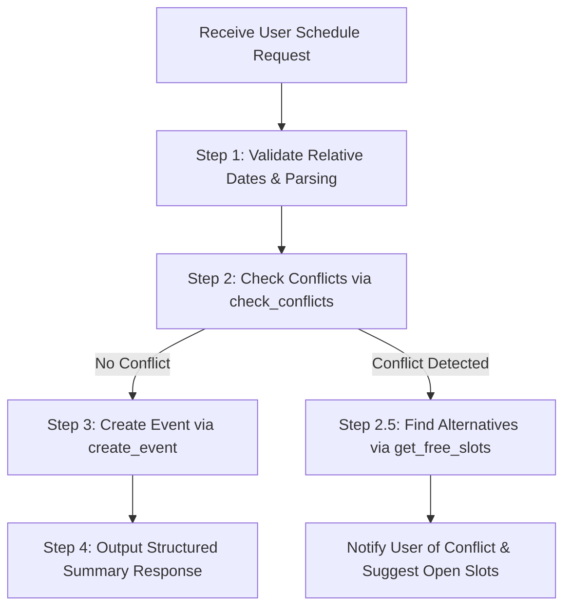

# ▶ Smart Calendar Scheduler Playbook

This skill defines the standard operating playbook for the **Personal Calendar Agent** when handling user schedule requests, validating dates, preventing schedule conflicts, and recommending optimal free time slots.

---

## ▶ Core Workflow Execution Steps

Follow this 4-step workflow in sequence when creating, updating, or querying events:



---

## ▶ Detailed Step-by-step Guidelines

### Step 1: Relative Date Parsing & Validation
- For relative expressions (e.g. `today`, `tomorrow`, `this Thursday`, `next Monday`), prioritize the System Prompt's **[Accurate YYYY-MM-DD Date Mapping]** table.
- If duration is not specified, default to **1 hour (e.g. 14:00 ~ 15:00)**.

### Step 2: Pre-Creation Conflict Check (`check_conflicts`)
- **Always execute `check_conflicts` first** before creating an event (`create_event`) to verify if the slot (`start_time` ~ `end_time`) overlaps with existing events.
- **When Conflict is Detected**:
  1. Do NOT force event creation immediately.
  2. Call `get_free_slots` to retrieve alternative open time slots for that day.
  3. Inform the user of the conflicting event details and present recommended alternative slots.

### Step 3: Event Creation & Update (`create_event` / `update_event`)
- Save the event once validation passes or the user explicitly confirms creation.
- Pass location (`location`), attendees (`attendees`), and details (`description`) whenever provided.

### Step 4: Output Response Formatting
Maintain the following **single-width Unicode structure** for precise terminal alignment:

```markdown
✔ **Event successfully created!**

- ▶ **Title**: [Event Title]
- ⏱ **Time**: YYYY-MM-DD HH:MM ~ HH:MM
- ■ **Location**: [Location or TBD]
- ● **Attendees**: [Attendees or None]
- ◆ **Notes**: [Description]
```

---

## ▶ Guardrails & Prohibitions

1. **No LLM Calendar Arithmetic Hallucinations**:
   - Do NOT rely on pre-trained LLM calendar weights (e.g. 2023 dates).
2. **No Unnecessary Explanations or Insight Blocks**:
   - Never append `Insight`, `★ Insight`, reasoning steps, or internal operation explanations in the final output.
3. **No 2-Cell Wide Emojis**:
   - Prohibit wide emojis (📅, 📊, 🛠️, 📌). Use single-width Unicode symbols: ✔ (\u2714), ℹ (\u2139), ▶ (\u25b6), ⏱ (\u23f1), ■ (\u25a0), ● (\u25cf), ◆ (\u25c6), ✖ (\u2716).
4. **Dynamic Multi-Lingual Response Policy**:
   - Match the user's input prompt language for final response content (Korean prompt -> Korean, English prompt -> English).
   - Preserve terminal debug logs, system symbols (`[TOOL CALL]`, `[THOUGHT]`, `mcp__calendar__*`, ▶, ✔, ⏱) in English regardless of the user's language.

---

## ▶ Official Documentation References

- **Anthropic Agent Design Guide**: [Building Agents with the Claude Agent SDK](https://www.anthropic.com/engineering/building-agents-with-the-claude-agent-sdk)
- **Model Context Protocol (MCP)**: [MCP Specification & Tool Schema](https://modelcontextprotocol.io/introduction)
- **Agent Skill Standard Protocol**: [Agent Skills Specification & Directory Structure](https://github.com/agentskills/agentskills)
