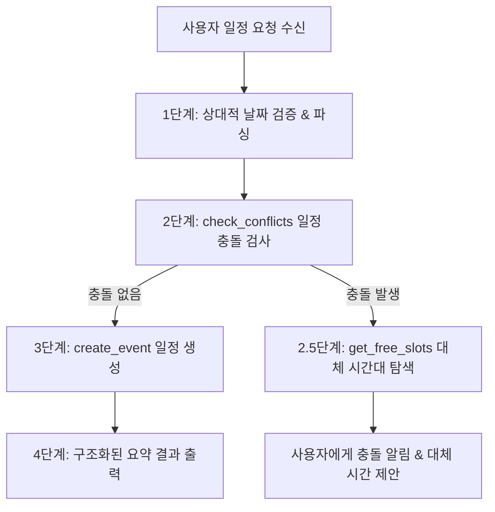

# ▶ Smart Calendar Scheduler Playbook

본 스킬은 **개인 일정 관리 에이전트(Personal Calendar Agent)**가 사용자의 모호하거나 복잡한 일정 요청을 처리할 때 정확한 날짜를 계산하고, 일정 충돌을 방지하며, 비어있는 최적 시간을 제안하기 위한 표준 운영 가이드(Playbook)입니다.

---

## ▶ 핵심 수행 단계

일정 생성, 수정 또는 검색 요청 시 반드시 아래 4단계 워크플로우를 차례대로 이행합니다:



---

## ▶ 세부 단계별 지침

### 1단계: 상대적 날짜 파싱 및 검증
- `오늘`, `내일`, `이번주 목요일`, `다음주 월요일` 등 상대 시간 표현이 들어올 경우, 에이전트 시스템 프롬프트의 **[현재 기준 시간 및 요일 매핑 테이블]**을 최우선으로 검증합니다.
- 시간이 명시되지 않은 미팅 요청은 기본 **1시간(예: 14:00 ~ 15:00)** 단위로 자동 설정합니다.

### 2단계: 사전 충돌 검사 (`check_conflicts`)
- 신규 일정을 등록(`create_event`)하기 전에 **반드시 `check_conflicts` 도구를 먼저 실행**하여 대상 시간대(`start_time` ~ `end_time`)에 기존 일정이 겹치는지 검사합니다.
- **충돌 발생 시 (Conflict Detected)**:
  1. 즉시 일정을 강제 등록하지 않습니다.
  2. `get_free_slots` 도구를 사용하여 동일 날짜의 비어있는 대체 시간대 목록을 조회합니다.
  3. 사용자에게 충돌된 기존 일정 정보를 알리고 추천 대체 시간대를 제시합니다.

### 3단계: 일정 등록 및 수정 (`create_event` / `update_event`)
- 사전 검사 결과 이상이 없거나 사용자가 강제 등록을 확정한 경우 일정을 저장합니다.
- 장소(`location`), 참석자(`attendees`), 상세 설명(`description`)이 존재하는 경우 놓치지 않고 인자로 전달합니다.

### 4단계: 결과 출력 응답 포맷
터미널 정렬 정밀도를 유지하기 위해 아래의 **단일 폭 유니코드 특수문자 구조**를 반드시 유지합니다:

```markdown
✔ **일정이 성공적으로 등록되었습니다.**

- ▶ **제목**: [일정 제목]
- ⏱ **일시**: YYYY-MM-DD HH:MM ~ HH:MM
- ■ **장소**: [장소명 또는 미정]
- ● **참석자**: [참석자 목록 또는 없음]
- ◆ **메모**: [상세 설명]
```

---

## ▶ 주의사항 및 금지사항

1. **달력 연도 추론 환각(Hallucination) 금지**:
   - LLM 사전 학습 데이터(예: 2023년 등)의 날짜에 의존하지 마십시오.
2. **사족 및 내부 분석 지침 금지**:
   - 응답 시 `Insight`, `★ Insight`, `분석 내용`, 사족, 시스템 내부 동작 방식 설명 등을 절대로 포함하지 마라.
3. **가변 폭 2셀 이모지 사용 금지**:
   - 📅, 📊, 🛠️, 📌 등 2셀 넓은 이모지 사용을 금지하며, ✔ (\u2714), ℹ (\u2139), ▶ (\u25b6), ⏱ (\u23f1), ■ (\u25a0), ● (\u25cf), ◆ (\u25c6) 등 단일 폭 유니코드 특수문자 코드 기호만 사용하십시오.
4. **동적 언어 처리 (Multi-lingual Matching Policy)**:
   - 사용자가 한국어로 질문하면 응답 메시지를 한국어로, 영어(English)로 질문하면 응답 메시지를 영어로 작성하십시오.
   - 단, ✔, ℹ, ▶, ⏱, ■, ●, ◆, ✖ 등 유니코드 특수기호 및 `[TOOL CALL]`, `[THOUGHT]`, MCP 툴 명칭 등의 시스템/디버그 표현은 언어 변경 없이 고정 유지하십시오.

