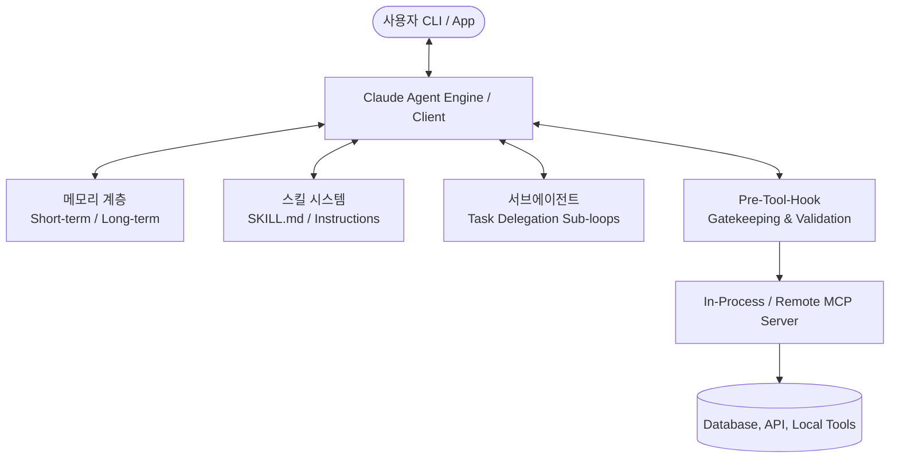
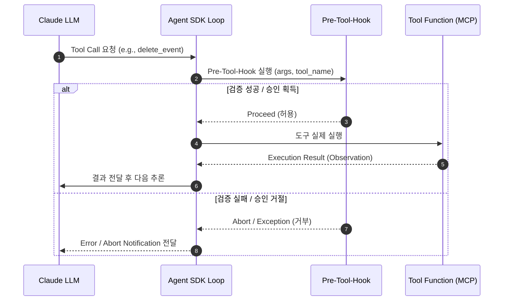

# 📖 Claude Agent SDK 상세 지침, 핵심 개념 및 Pre-Tool-Hook 가이드 (CLAUDE_AGENT_SDK_DETAILS.md)

본 문서는 **Anthropic Claude Agent SDK**의 상세 아키텍처, 에이전트의 4대 핵심 구성 요소(메모리, 스킬, 서브에이전트, MCP), 그리고 에이전트의 안전한 도구 실행 제어를 위한 **Pre-Tool-Hook(사전 도구 후크)**에 대한 세부 가이드 및 모범 사례를 정리한 종합 기술 문서입니다.

---

## 📚 목차
1. [Claude Agent SDK 개요 및 핵심 아키텍처](#1-claude-agent-sdk-개요-및-핵심-아키텍처)
2. [에이전트 4대 핵심 구성 요소](#2-에이전트-4대-핵심-구성-요소)
   - [2.1 메모리 및 상태 관리 (Memory & State Management)](#21-메모리-및-상태-관리-memory--state-management)
   - [2.2 스킬 시스템 (Skills / Playbooks & `SKILL.md`)](#22-스킬-시스템-skills--playbooks--skillmd)
   - [2.3 서브에이전트 및 멀티 에이전트 오케스트레이션 (Subagents & Multi-Agent Architecture)](#23-서브에이전트-및-멀티-에이전트-오케스트레이션-subagents--multi-agent-architecture)
   - [2.4 MCP (Model Context Protocol: In-Process vs Remote)](#24-mcp-model-context-protocol-in-process-vs-remote)
   - [2.5 환경 변수 및 설정 파일 기반 동적 MCP 구성 (Declarative MCP Management)](#25-환경-변수-및-설정-파일-기반-동적-mcp-구성-declarative-mcp-management)
3. [Pre-Tool-Hook (사전 도구 후크) 메커니즘](#3-pre-tool-hook-사전-도구-후크-메커니즘)
4. [Pre-Tool-Hook 주요 유스케이스 및 구현 예시](#4-pre-tool-hook-주요-유스케이스-및-구현-예시)
5. [In-Process MCP & `@tool` 연동 구조](#5-in-process-mcp--tool-연동-구조)
6. [세션 관리 (`ClaudeSDKClient` vs `query`)](#6-세션-관리-claudesdkclient-vs-query)
7. [최소 권한 제어 & 보안 (`allowed_tools`)](#7-최소-권한-제어--보안-allowed_tools)
8. [멀티 클라우드 Provider (AWS Bedrock & GCP Vertex AI) 연동](#8-멀티-클라우드-provider-aws-bedrock--gcp-vertex-ai-연동)

---

## 1. Claude Agent SDK 개요 및 핵심 아키텍처

Claude Agent SDK는 자율형 AI 에이전트를 프로덕션 환경에서 손쉽게 구축하도록 돕는 파이썬 전용 프레임워크입니다. 에이전트 개발 시 가장 구현하기 복잡한 **Agent Loop (사고 → 행동 → 관찰 → 반복)** 및 도구 연동 인프라(Harness)를 내장하고 있어, 개발자가 별도의 메시지 포매팅 루프를 직접 작성할 필요 없이 자율 구동형 애플리케이션을 완성할 수 있습니다.



---

## 2. 에이전트 4대 핵심 구성 요소

### 2.1 메모리 및 상태 관리 (Memory & State Management)

#### 개념
* **단기 메모리 (Short-term Memory)**: 현재 대화 세션 동안 주고받은 메시지 이력(User Prompt, Assistant Thought, Tool Call, Observation)을 유지하는 대화 컨텍스트입니다.
* **장기 메모리 (Long-term Memory)**: 영구 데이터베이스(SQLite, PostgreSQL)나 베터 DB에 저장하여 세션이 종료된 후에도 사용자의 선호도, 과거 작업 내역, 지식을 보존하는 영역입니다.
* **Context Compaction (컨텍스트 최적화)**: 메시지 수가 늘어남에 따라 LLM의 입력 토큰 한도를 초과하지 않도록 오래된 이력을 요약(Summarize)하거나 슬라이딩 윈도우로 압축합니다.

#### Python 구현 예시 (`agent/memory.py`)
```python
from typing import List, Dict, Any

class AgentMemoryManager:
    """대화 이력 및 영구 메모리 관리 모듈"""
    def __init__(self, max_history_turns: int = 10):
        self.history: List[Dict[str, Any]] = []
        self.max_history_turns = max_history_turns

    def add_message(self, role: str, content: str):
        self.history.append({"role": role, "content": content})
        self._trim_context_if_needed()

    def _trim_context_if_needed(self):
        """컨텍스트 오염을 막기 위한 슬라이딩 윈도우 정리"""
        if len(self.history) > self.max_history_turns * 2:
            # 오래된 메시지를 잘라내거나 요약 메시지로 대체
            trimmed = self.history[-self.max_history_turns * 2:]
            self.history = [{"role": "system", "content": "[이전 대화 요약됨]"}] + trimmed

    def get_context(self) -> List[Dict[str, Any]]:
        return self.history
```

---

### 2.2 스킬 시스템 (Skills / Playbooks, `skills` Options & `SKILL.md`)

#### 개념
* **동적 지침 로딩 (Dynamic Instruction Loading)**: 에이전트의 System Prompt에 모든 업무 지침과 가이드를 일괄 작성하면 토큰이 낭비되고 환각이 증가합니다.
* **`SKILL.md` 플레이북**: 특정 업무(예: 일정 충돌 해결 플레이북)를 모듈화된 `SKILL.md` 디렉토리로 작성해두고, 에이전트가 해당 작업이 필요할 때만 런타임에 읽어 들여 활용합니다.
* **다국어 응답 & 시스템 명칭 보존 지침**: 사용자의 입력 언어에 맞춰 답변 언어를 선택하되, `[TOOL CALL]`, `[THOUGHT]`, `mcp__calendar__*`, 유니코드 특수문자(`▶`, `✔`, `⏱` 등) 및 터미널 디버그 로그의 영문 표현은 사용자 언어와 무관하게 100% 보존합니다.

#### `SKILL.md` 구조 및 예시 (`.agents/skills/calendar-smart-scheduler/SKILL.md`)
```markdown
---
name: calendar-smart-scheduler
description: Smart calendar scheduling and conflict resolution playbook for Personal Calendar Agent.
---

# ▶ Smart Calendar Scheduler Playbook

1. 사용자가 질문한 언어(한국어/영어 등)에 맞춰 답변 언어를 동적으로 선택합니다.
2. 단, ✔, ℹ, ▶, ⏱, ■, ●, ◆, ✖ 등 유니코드 특수기호 및 [TOOL CALL], [THOUGHT] 등의 시스템/디버그 표현은 언어 변경 없이 고정 유지합니다.
3. 사전 충돌 검사(`check_conflicts`) 및 대체 시간 추천(`get_free_slots`) 워크플로우를 반드시 이행합니다.
```

#### Python SDK Skills Injection 예시 (`agent/core.py`)
```python
options = ClaudeAgentOptions(
    system_prompt=system_prompt,
    mcp_servers=mcp_servers,
    allowed_tools=allowed_tools,
    skills=["calendar-smart-scheduler"],  # 프로젝트 스킬 활성화
    setting_sources=["user", "project"],   # .agents/skills 탐색 바인딩
    thinking={"type": "disabled"}
)
```

def load_skill_instructions(skill_name: str) -> str:
    skill_path = os.path.join("skills", skill_name, "SKILL.md")
    if os.path.exists(skill_path):
        with open(skill_path, "r", encoding="utf-8") as f:
            return f.read()
    return ""

# 에이전트 실행 시 필요 스킬 지침을 System Prompt에 동적 결합
base_prompt = "너는 지능형 개인 비서 에이전트이다."
analytics_skill = load_skill_instructions("calendar-analytics")
full_system_prompt = f"{base_prompt}\n\n[전문 스킬 플레이북]\n{analytics_skill}"
```

---

### 2.3 서브에이전트 및 멀티 에이전트 오케스트레이션 (Subagents & Multi-Agent Architecture)

#### 개념
* **태스크 위임 (Task Delegation)**: 대규모 복합 작업(예: "데이터 분석 + 보고서 작성 + 이메일 전송")을 수행할 때, 메인 에이전트(Orchestrator)가 모든 일을 직접 하지 않고 세부 업무를 전문 **서브에이전트(Subagent)**에게 위임합니다.
* **독립 컨텍스트 (Isolated Context)**: 서브에이전트는 독립된 System Prompt, 툴 세트, 대화 메모리를 가지고 작업을 완수한 후 최종 결과만 오케스트레이터에게 반환하여 메인 대화창의 토큰 오염을 방지합니다.

#### Python 서브에이전트 위임 툴 예시
```python
from pydantic import BaseModel, Field
from claude_agent_sdk import tool, ClaudeSDKClient, ClaudeAgentOptions

class SubagentTaskInput(BaseModel):
    task_description: str = Field(..., description="서브에이전트에게 위임할 세부 분석 작업")

@tool("delegate_to_analyst", "데이터 분석 전문 서브에이전트에게 작업 위임", SubagentTaskInput)
async def delegate_to_analyst(args: dict) -> dict:
    """독립적인 분석 전용 서브에이전트 실행"""
    sub_options = ClaudeAgentOptions(
        system_prompt="너는 데이터 분석 전문 서브에이전트이다. 주어진 데이터의 통계 요약을 작성하라.",
        allowed_tools=["mcp__analytics__*"],
        thinking={"type": "disabled"}
    )
    sub_client = ClaudeSDKClient(options=sub_options)
    
    # 서브에이전트 실행 및 결과 수집
    response = await sub_client.query(args["task_description"])
    return {
        "content": [{"type": "text", "text": f"[서브에이전트 분석 결과]\n{response}"}]
    }
```

---

### 2.4 MCP (Model Context Protocol: In-Process vs Remote)

#### 개념
* **MCP (Model Context Protocol)**: Anthropic이 제안한 AI 모델과 외부 데이터/도구를 연결하는 open standard 프로토콜입니다.
* **In-Process MCP (`create_sdk_mcp_server`)**: 별도의 프로세스나 소켓 통신 오버헤드 없이 Python 애플리케이션 내부 메모리 상에서 직접 `@tool`을 바인딩하여 속도가 빠르고 배포가 간단합니다.
* **Remote / External Subprocess MCP**: 별도의 서버 프로세스(Node.js, Docker, Remote API) 형태로 실행되어 네트워크를 통해 에이전트와 도구를 분리 관리합니다.

#### In-Process vs Remote 비교
| 항목 | In-Process MCP (`create_sdk_mcp_server`) | Remote / Subprocess MCP |
| :--- | :--- | :--- |
| **실행 위치** | 파이썬 에이전트와 동일한 프로세스 | 독립된 프로세스 또는 외부 서버 |
| **통신 방식** | Direct In-memory Call | Stdio / HTTP / SSE (Server-Sent Events) |
| **장점** | 배포가 간편하고 속도가 빠르며 프로세스 관리 부담 없음 | 다양한 언어(Node, Go, Rust)로 작성된 기존 MCP 서버 재활용 가능 |

---

### 2.5 환경 변수 및 설정 파일 기반 동적 MCP 구성 (Declarative MCP Management)

#### 개념 및 필요성
코드 내부에서 MCP 서버를 직접 하드코딩하여 바인딩하면 환경(개발, 대규모 테스트, 프로덕션)이나 사용자 권한에 따라 도구를 제어하기 어렵습니다. 
Claude Agent SDK 구현 시 **환경 변수(`.env`)**, **JSON/YAML 설정 파일(`mcp_config.json`)**, **CLI 인풋 인자**를 통해 선언적(Declarative)으로 MCP 연결을 구성할 수 있습니다.

#### 1) JSON 설정 파일 기반 구성 (`mcp_config.json`)
외부 Stdio MCP 서버(Node.js, Python, Git 등)나 In-process 툴 등록 정보를 외부 설정 파일로 관리합니다.

```json
{
  "mcp_servers": {
    "filesystem": {
      "command": "npx",
      "args": ["-y", "@modelcontextprotocol/server-filesystem", "/Users/jason/dev/ai"],
      "env": {
        "NODE_ENV": "production"
      }
    },
    "git": {
      "command": "uvx",
      "args": ["mcp-server-git", "--repository", "."]
    }
  },
  "allowed_tools": [
    "mcp__filesystem__*",
    "mcp__git__read_*"
  ]
}
```

##### Python 런타임 동적 설정 로더 예시
```python
import json
import os
from typing import Dict, Any
from claude_agent_sdk import ClaudeAgentOptions, ClaudeSDKClient

def load_mcp_config_from_file(config_path: str = "mcp_config.json") -> Dict[str, Any]:
    """JSON 설정 파일에서 MCP 서버 규격과 allowed_tools를 동적으로 파싱"""
    if not os.path.exists(config_path):
        return {"mcp_servers": {}, "allowed_tools": []}
        
    with open(config_path, "r", encoding="utf-8") as f:
        config_data = json.load(f)
        
    return config_data

# 설정 파일 로드 후 Options 동적 생성
config = load_mcp_config_from_file("mcp_config.json")

options = ClaudeAgentOptions(
    system_prompt="설정 파일로 동적 구성된 에이전트입니다.",
    mcp_servers=config.get("mcp_servers", {}),
    allowed_tools=config.get("allowed_tools", []),
    thinking={"type": "disabled"}
)
client = ClaudeSDKClient(options=options)
```

#### 2) 환경 변수(`.env`) 기반 동적 툴 스위칭 & 팩토리 패턴
환경 변수 플래그(예: `ENABLE_CALENDAR_MCP=true`, `ENABLE_ANALYTICS_MCP=false`)에 따라 In-Process 및 Remote MCP 서버를 선택적으로 바인딩합니다.

```python
import os
from dotenv import load_dotenv
from claude_agent_sdk import ClaudeAgentOptions, create_sdk_mcp_server

load_dotenv()

def build_dynamic_mcp_options() -> ClaudeAgentOptions:
    mcp_servers = {}
    allowed_tools = []
    
    # 1. 환경 변수 체크 - 일정 관리 툴 활성화 여부
    if os.getenv("ENABLE_CALENDAR_MCP", "true").lower() == "true":
        from tools.calendar_tools import calendar_tool_list
        mcp_servers["calendar"] = create_sdk_mcp_server("calendar", tools=calendar_tool_list)
        allowed_tools.append("mcp__calendar__*")
        
    # 2. 환경 변수 체크 - 외부 파일시스템 Stdio MCP 활성화 여부
    if os.getenv("ENABLE_FILESYSTEM_MCP", "false").lower() == "true":
        target_dir = os.getenv("MCP_FILESYSTEM_DIR", "./storage")
        mcp_servers["filesystem"] = {
            "command": "npx",
            "args": ["-y", "@modelcontextprotocol/server-filesystem", target_dir]
        }
        allowed_tools.append("mcp__filesystem__*")
        
    return ClaudeAgentOptions(
        system_prompt="환경 변수 기반으로 동적 구성된 에이전트입니다.",
        mcp_servers=mcp_servers,
        allowed_tools=allowed_tools,
        thinking={"type": "disabled"}
    )
```

---

## 3. Pre-Tool-Hook (사전 도구 후크) 메커니즘

### 개념 및 동작 방식
**Pre-Tool-Hook**은 LLM이 추론 과정을 거쳐 특정 도구(Tool)를 실행하기로 결정한 직후, **실제 도구 함수의 로직이 실행되기 바로 전 단계**에서 가로채서(Intercept) 지정된 검증 및 승인 코드를 수행하는 콜백(Callback) 메커니즘입니다.



---

## 4. Pre-Tool-Hook 주요 유스케이스 및 구현 예시

Pre-Tool-Hook은 시스템 안전성과 신뢰성을 크게 향상시킬 수 있으며 대표적으로 다음과 같은 영역에서 활용됩니다:

### ① Human-in-the-Loop (파괴적 작업의 사용자 승인)
DB 삭제, 이메일 발송, 결제 등 파괴적이거나 돌이킬 수 없는 툴 호출 시 사용자에게 팝업 또는 CLI 인터랙션으로 승인을 요청합니다.

### ② 파라미터 검증 & 입력 정제 (Input Sanitization & Validation)
Pydantic 스키마 수준을 넘어선 도메인 비즈니스 로직(예: 과거 날짜로 삭제 요청 금지, 허용된 시간대 범위 체크 등)을 사전에 검증합니다.

### ③ 세밀한 접근 권한 제어 (Fine-grained Authorization / RBAC)
사용자의 세션 역할(Role)이나 토큰에 따라 특정 리소스 ID에 대한 액세스 권한이 있는지 검사합니다.

### ④ 보안 감사 로깅 (Audit Logging)
모든 도구 실행 시도에 대한 시각, 호출자, 인자(Arguments)를 중앙 관리형 감사 로그 시스템에 투명하게 남깁니다.

### 💻 Python 구현 코드 예시

```python
from typing import Any, Dict, Callable
from claude_agent_sdk import ClaudeAgentOptions, ClaudeSDKClient

async def calendar_pre_tool_hook(tool_name: str, tool_input: Dict[str, Any]) -> bool:
    """
    사전 도구 실행 검증 후크 (Pre-Tool-Hook)
    :param tool_name: 호출하려는 툴 이름 (예: 'mcp__calendar__delete_calendar_event')
    :param tool_input: 툴에 전달되는 파라미터 딕셔너리
    :return: True일 경우 진행, False 또는 Exception 발생 시 도구 실행 차단
    """
    print(f"🔍 [Pre-Tool-Hook] 툴 실행 요청 가로챔: {tool_name}")
    print(f"   - 전달 인자: {tool_input}")
    
    # 1. 파괴적 액션 사용자 승인 (Human-in-the-Loop)
    if "delete" in tool_name or "remove" in tool_name:
        user_approval = input(f"⚠️ [보안 경고] '{tool_name}' 실행을 승인하시겠습니까? (y/N): ")
        if user_approval.lower() != 'y':
            print("❌ 사용자에 의해 도구 실행이 거부되었습니다.")
            raise PermissionError("User declined execution of sensitive tool.")
            
    # 2. 비즈니스 유효성 검증
    if tool_name.endswith("create_calendar_event"):
        title = tool_input.get("title", "")
        if len(title) < 2:
            raise ValueError("일정 제목은 최소 2자 이상이어야 합니다.")
            
    return True

# Options 설정 시 pre_tool_hook 등록
options = ClaudeAgentOptions(
    system_prompt="일정 관리 도우미입니다.",
    mcp_servers={"calendar": calendar_mcp_server},
    allowed_tools=["mcp__calendar__*"],
    pre_tool_hook=calendar_pre_tool_hook,  # Pre-tool-hook 바인딩
    thinking={"type": "disabled"}
)
```

---

## 5. In-Process MCP & `@tool` 연동 구조

Claude Agent SDK는 파이썬 코드 내부에서 별도 서브프로세스 관리 없이 직관적으로 MCP Server를 생성하는 `create_sdk_mcp_server` 기능을 지원합니다.

```python
from pydantic import BaseModel, Field
from claude_agent_sdk import tool, create_sdk_mcp_server

class EventSearchInput(BaseModel):
    query: str = Field(..., description="검색할 일정 키워드")
    limit: int = Field(default=5, description="최대 결과 개수")

@tool("search_events", "일정 키워드 검색 도구", EventSearchInput)
async def search_events(args: dict) -> dict:
    # 비즈니스 로직 수행
    results = ["1. 서버사이드 태깅 미팅 (10:30)", "2. 팀 주간 보고 (14:00)"]
    return {
        "content": [
            {"type": "text", "text": "\n".join(results)}
        ]
    }

# In-Process MCP Server 등록
calendar_mcp_server = create_sdk_mcp_server(
    name="calendar",
    tools=[search_events]
)
```

---

## 6. 세션 관리 (`ClaudeSDKClient` vs `query`)

| 방식 | 사용 사례 | 특징 및 권장 사항 |
| :--- | :--- | :--- |
| **`query()`** | 단발성 태스크 | 단일 질문/응답 처리. 대화 컨텍스트가 유지되지 않는 1회성 스크립트에 적합 |
| **`ClaudeSDKClient`** | 대화형 세션 | 대화 이력 유지, 멀티턴 툴 연동, 양방향 터미널 CLI 에이전트 개발에 필수로 사용 |

---

## 7. 최소 권한 제어 & 보안 (`allowed_tools`)

에이전트에게 필요한 도구만 선택적으로 노출하여 불필요한 권한 남용 및 환각 호출을 원천 차단합니다:

```python
options = ClaudeAgentOptions(
    mcp_servers={"calendar": calendar_mcp_server},
    # 특정 MCP 서버의 모든 툴 허용
    allowed_tools=["mcp__calendar__*"],
    # 명시적 개별 툴 허용 지정 가능
    # allowed_tools=["mcp__calendar__get_today_events", "mcp__calendar__create_calendar_event"]
)
```

---

## 8. 멀티 클라우드 Provider (AWS Bedrock & GCP Vertex AI) 연동

Anthropic Direct API 외에 Enterprise 인프라 환경인 AWS Bedrock 및 GCP Vertex AI 엔드포인트를 손쉽게 지원합니다.

### AWS Bedrock 설정
```env
CLAUDE_CODE_USE_BEDROCK=1
AWS_ACCESS_KEY_ID=your_key
AWS_SECRET_ACCESS_KEY=your_secret
AWS_REGION=us-west-2
BEDROCK_MODEL_ID=us.anthropic.claude-sonnet-4-20250514-v1:0
```

### Extended Thinking 이슈 방지 (`thinking={"type": "disabled"}`)
Bedrock 연동 시 도구 호출 루프(Tool execution loop)에서 Extended thinking 블록 타입 불일치로 발생하는 `API Error 400`을 방지하기 위해 `ClaudeAgentOptions` 생성 시 `thinking={"type": "disabled"}` 옵션을 지정합니다.

---

## 📄 관련 문서 인덱스 & 공식 문서 References

### 프로젝트 로컬 문서
* [전체 안내서 (README.md)](file:///Users/jason/dev/ai/my-personal-calendar-agent/README.md)
* [Claude Agent 개발 마니페스트 (CLAUDE_AGENT_MANIFEST.md)](file:///Users/jason/dev/ai/my-personal-calendar-agent/CLAUDE_AGENT_MANIFEST.md)
* [버그 조치 및 원인 분석 문서 (BUG_FIX.md)](file:///Users/jason/dev/ai/my-personal-calendar-agent/BUG_FIX.md)

### 공식 기술 문서 (Official Documentation References)
* **Anthropic Claude Agent SDK**: [Anthropic Engineering Blog - Building Agents with the Claude Agent SDK](https://www.anthropic.com/engineering/building-agents-with-the-claude-agent-sdk)
* **Model Context Protocol (MCP)**: [MCP Official Specification & Documentation](https://modelcontextprotocol.io/introduction)
* **Anthropic Claude API**: [Anthropic API Documentation & Prompt Engineering Guide](https://docs.anthropic.com/en/docs/welcome)
* **AWS Bedrock Integration**: [AWS Bedrock User Guide - Anthropic Claude Models](https://docs.aws.amazon.com/bedrock/latest/userguide/model-parameters-claude.html)
* **Pydantic Schema Validation**: [Pydantic Official Documentation](https://docs.pydantic.dev/latest/)
* **Rich Terminal UI**: [Rich Official Documentation](https://rich.readthedocs.io/en/latest/)
