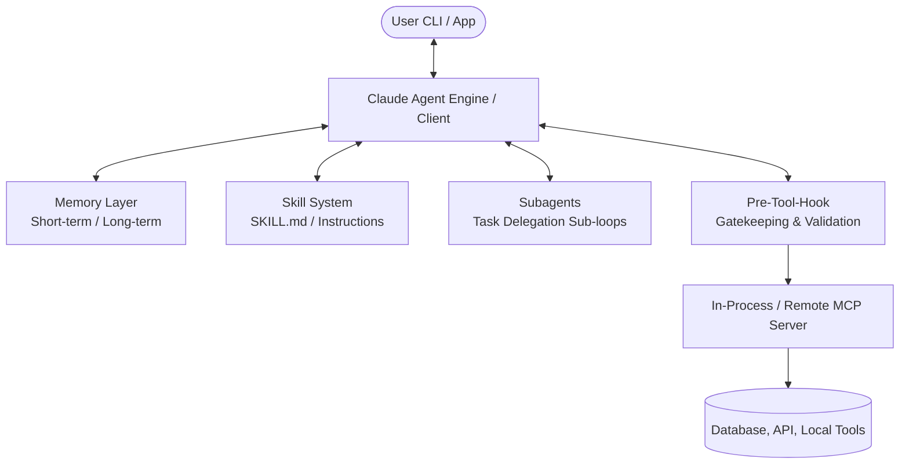
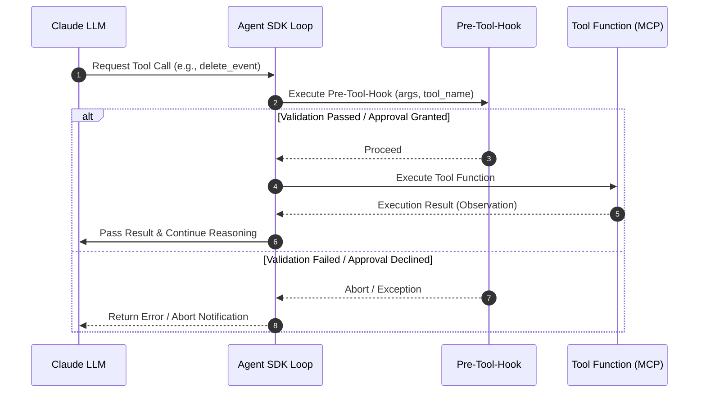

# 📖 Claude Agent SDK Technical Guide & Pre-Tool-Hook Specification (CLAUDE_AGENT_SDK_DETAILS.md)

This comprehensive technical guide details the architecture of the **Anthropic Claude Agent SDK**, its 4 Core Agent Pillars (Memory, Skills, Subagents, MCP), and the implementation of **Pre-Tool-Hooks** for secure, controlled tool execution.

---

## 📚 Table of Contents
1. [Claude Agent SDK Overview & Core Architecture](#1-claude-agent-sdk-overview--core-architecture)
2. [4 Core Agent Pillars](#2-4-core-agent-pillars)
   - [2.1 Memory & State Management](#21-memory--state-management)
   - [2.2 Skill System (Skills / Playbooks & `SKILL.md`)](#22-skill-system-skills--playbooks--skillmd)
   - [2.3 Subagents & Multi-Agent Orchestration](#23-subagents--multi-agent-orchestration)
   - [2.4 MCP (Model Context Protocol: In-Process vs Remote)](#24-mcp-model-context-protocol-in-process-vs-remote)
   - [2.5 Declarative MCP Management](#25-declarative-mcp-management)
3. [Pre-Tool-Hook Mechanism](#3-pre-tool-hook-mechanism)
4. [Pre-Tool-Hook Primary Use Cases & Code Examples](#4-pre-tool-hook-primary-use-cases--code-examples)
5. [In-Process MCP & `@tool` Integration](#5-in-process-mcp--tool-integration)
6. [Session Control (`ClaudeSDKClient` vs `query`)](#6-session-control-claudesdkclient-vs-query)
7. [Principle of Least Privilege & Security (`allowed_tools`)](#7-principle-of-least-privilege--security-allowed_tools)
8. [Multi-Cloud Provider Support (AWS Bedrock & GCP Vertex AI)](#8-multi-cloud-provider-support-aws-bedrock--gcp-vertex-ai)

---

## 1. Claude Agent SDK Overview & Core Architecture

The Claude Agent SDK is a Python framework designed to build autonomous AI agents in production environments. It encapsulates the **Agent Loop (Thought $\rightarrow$ Action $\rightarrow$ Observation $\rightarrow$ Repeat)** and execution Harness, enabling developers to build autonomous applications without writing manual message parsing loops.



---

## 2. 4 Core Agent Pillars

### 2.1 Memory & State Management

#### Concepts
* **Short-term Memory**: Manages in-session message history (User Prompt, Assistant Thought, Tool Call, Observation) across turns.
* **Long-term Memory**: Persists user preferences, past task records, and domain knowledge across sessions using database backends (SQLite, PostgreSQL, Vector DBs).
* **Context Compaction**: Summarizes or truncates older conversation history via sliding windows to stay within LLM token limits and prevent context degradation.

#### Python Implementation Example (`agent/memory.py`)
```python
from typing import List, Dict, Any

class AgentMemoryManager:
    """Conversation history and long-term memory management module"""
    def __init__(self, max_history_turns: int = 10):
        self.history: List[Dict[str, Any]] = []
        self.max_history_turns = max_history_turns

    def add_message(self, role: str, content: str):
        self.history.append({"role": role, "content": content})
        self._trim_context_if_needed()

    def _trim_context_if_needed(self):
        """Sliding window context compaction to prevent prompt inflation"""
        if len(self.history) > self.max_history_turns * 2:
            trimmed = self.history[-self.max_history_turns * 2:]
            self.history = [{"role": "system", "content": "[Previous conversation history summarized]"}] + trimmed

    def get_context(self) -> List[Dict[str, Any]]:
        return self.history
```

---

### 2.2 Skill System (Skills / Playbooks, `skills` Options & `SKILL.md`)

#### Concepts
* **Dynamic Instruction Loading**: Placing all business playbooks directly into the System Prompt causes token bloat and increased hallucination risk.
* **`SKILL.md` Playbooks**: Encapsulates specialized task procedures (e.g. schedule conflict resolution playbooks) in `.agents/skills/<skill_name>/SKILL.md` files, which are dynamically loaded at runtime when required.
* **Multi-Lingual Response Policy**: Matches the user's query language for final output while preserving terminal debug logs, system symbols (`[TOOL CALL]`, `[THOUGHT]`, `mcp__calendar__*`, ▶, ✔, ⏱, ■, ●, ◆, ℹ, ✖) in English.

#### `SKILL.md` Structure & Example (`.agents/skills/calendar-smart-scheduler/SKILL.md`)
```markdown
---
name: calendar-smart-scheduler
description: Smart calendar scheduling and conflict resolution playbook for Personal Calendar Agent.
---

# ▶ Smart Calendar Scheduler Playbook

1. Dynamically match the user's query language (Korean, English, etc.) for final responses.
2. Preserve unicode symbols (✔, ℹ, ▶, ⏱) and system log terms ([TOOL CALL], [THOUGHT]) in English.
3. Perform pre-creation conflict checks (`check_conflicts`) and free slot discovery (`get_free_slots`).
```

#### Python SDK Skills Injection Example (`agent/core.py`)
```python
options = ClaudeAgentOptions(
    system_prompt=system_prompt,
    mcp_servers=mcp_servers,
    allowed_tools=allowed_tools,
    skills=["calendar-smart-scheduler"],  # Enable project skills
    setting_sources=["user", "project"],   # Bind .agents/skills discovery
    thinking={"type": "disabled"}
)
```

---

### 2.3 Subagents & Multi-Agent Orchestration

#### Concepts
* **Task Delegation**: For complex compound tasks (e.g., "Analyze data + Generate report + Send email"), the main Orchestrator delegates specialized sub-tasks to dedicated **Subagents**.
* **Isolated Context**: Each subagent operates with its own System Prompt, toolset, and execution loop, returning only the final summary to the Orchestrator to keep the main context window clean.

#### Python Subagent Delegation Tool Example
```python
from pydantic import BaseModel, Field
from claude_agent_sdk import tool, ClaudeSDKClient, ClaudeAgentOptions

class SubagentTaskInput(BaseModel):
    task_description: str = Field(..., description="Detailed task description delegated to subagent")

@tool("delegate_to_analyst", "Delegate task to data analytics subagent", SubagentTaskInput)
async def delegate_to_analyst(args: dict) -> dict:
    """Execute an isolated data analytics subagent"""
    sub_options = ClaudeAgentOptions(
        system_prompt="You are a data analytics subagent. Generate statistical summaries for provided data.",
        allowed_tools=["mcp__analytics__*"],
        thinking={"type": "disabled"}
    )
    sub_client = ClaudeSDKClient(options=sub_options)
    
    response = await sub_client.query(args["task_description"])
    return {
        "content": [{"type": "text", "text": f"[Subagent Analysis Result]\n{response}"}]
    }
```

---

### 2.4 MCP (Model Context Protocol: In-Process vs Remote)

#### Concepts
* **MCP (Model Context Protocol)**: Anthropic's open standard protocol connecting AI models with external tools and data sources.
* **In-Process MCP (`create_sdk_mcp_server`)**: Binds `@tool` functions directly within Python process memory without subprocess or socket communication overhead, offering fast execution and zero-maintenance deployment.
* **Remote / Subprocess MCP**: Runs as separate server processes (Node.js, Docker, Remote API) communicating over networks or Stdio streams.

#### In-Process vs Remote Comparison
| Feature | In-Process MCP (`create_sdk_mcp_server`) | Remote / Subprocess MCP |
| :--- | :--- | :--- |
| **Execution Location** | Same process as Python agent | Independent process or remote server |
| **Communication** | Direct In-Memory Call | Stdio / HTTP / SSE (Server-Sent Events) |
| **Advantages** | Fast, lightweight, single-process deployment | Reuses existing MCP servers built in Node, Go, or Rust |

---

### 2.5 Declarative MCP Management

#### Concept
Hardcoding MCP server configurations in Python code makes tool management difficult across environments (dev, test, production). Claude Agent SDK supports declarative MCP configuration via **environment variables (`.env`)**, **JSON config files (`mcp.json`)**, and **CLI flags**.

#### JSON Configuration File (`mcp.json`)
```json
{
  "mcp_servers": {
    "filesystem": {
      "command": "npx",
      "args": ["-y", "@modelcontextprotocol/server-filesystem", "/Users/jason/dev/ai"],
      "env": {
        "NODE_ENV": "production"
      }
    },
    "git": {
      "command": "uvx",
      "args": ["mcp-server-git", "--repository", "."]
    }
  },
  "allowed_tools": [
    "mcp__filesystem__*",
    "mcp__git__read_*"
  ]
}
```

---

## 3. Pre-Tool-Hook Mechanism

### Concept & Execution Flow
A **Pre-Tool-Hook** is a callback mechanism that intercepts tool calls immediately after the LLM decides to invoke a tool, but **before the tool's actual function logic executes**, allowing custom validation and approval checks.



---

## 4. Pre-Tool-Hook Primary Use Cases & Code Examples

### ① Human-in-the-Loop (Approval for Destructive Actions)
Prompts users for explicit interactive confirmation before executing irreversible tool calls (database deletions, email sends, financial transactions).

### ② Parameter Validation & Input Sanitization
Validates business logic constraints beyond basic schema checks (e.g. prohibiting past-date deletions or enforcing allowed time window ranges).

### ③ Fine-grained Authorization (RBAC)
Verifies whether the caller's session role or auth token has permission to access specific resource IDs.

### ④ Security Audit Logging
Logs timestamped tool call attempts, caller IDs, and arguments to centralized audit log systems.

### 💻 Python Code Example
```python
from typing import Any, Dict

async def calendar_pre_tool_hook(tool_name: str, tool_input: Dict[str, Any]) -> bool:
    """
    Pre-Tool Execution Validation Hook
    :param tool_name: Tool name requested (e.g. 'mcp__calendar__delete_event')
    :param tool_input: Argument dictionary passed to tool
    :return: True to proceed, raises Exception / returns False to block
    """
    print(f"🔍 [Pre-Tool-Hook] Intercepted tool call: {tool_name}")
    print(f"   - Arguments: {tool_input}")
    
    # 1. Human-in-the-Loop approval for destructive actions
    if "delete" in tool_name or "remove" in tool_name:
        user_approval = input(f"⚠️ [Security Warning] Approve execution of '{tool_name}'? (y/N): ")
        if user_approval.lower() != 'y':
            print("❌ Tool execution declined by user.")
            raise PermissionError("User declined execution of sensitive tool.")
            
    # 2. Business logic validation
    if tool_name.endswith("create_event"):
        title = tool_input.get("title", "")
        if len(title) < 2:
            raise ValueError("Event title must be at least 2 characters long.")
            
    return True

options = ClaudeAgentOptions(
    system_prompt="Personal Calendar Assistant",
    mcp_servers={"calendar": calendar_mcp_server},
    allowed_tools=["mcp__calendar__*"],
    pre_tool_hook=calendar_pre_tool_hook,  # Bind pre-tool hook
    thinking={"type": "disabled"}
)
```

---

## 5. In-Process MCP & `@tool` Integration

```python
from pydantic import BaseModel, Field
from claude_agent_sdk import tool, create_sdk_mcp_server

class EventSearchInput(BaseModel):
    query: str = Field(..., description="Search keyword")
    limit: int = Field(default=5, description="Maximum results count")

@tool("search_events", "Calendar keyword search tool", EventSearchInput)
async def search_events(args: dict) -> dict:
    results = ["1. Server-side Tagging Sync (10:30)", "2. Team Weekly Sync (14:00)"]
    return {
        "content": [{"type": "text", "text": "\n".join(results)}]
    }

calendar_mcp_server = create_sdk_mcp_server(
    name="calendar",
    tools=[search_events]
)
```

---

## 6. Session Control (`ClaudeSDKClient` vs `query`)

| Method | Use Case | Features & Recommendations |
| :--- | :--- | :--- |
| **`query()`** | Single-turn Tasks | Process single question/answer without conversation state persistence. Ideal for one-shot scripts. |
| **`ClaudeSDKClient`** | Interactive Sessions | Maintains conversation history, handles multi-turn tool execution, and manages interactive terminal CLI agents. |

---

## 7. Principle of Least Privilege & Security (`allowed_tools`)

Exposes only explicitly permitted tools to prevent privilege abuse and hallucinated tool calls:
```python
options = ClaudeAgentOptions(
    mcp_servers={"calendar": calendar_mcp_server},
    allowed_tools=["mcp__calendar__*"],  # Allow all tools on calendar MCP server
)
```

---

## 8. Multi-Cloud Provider Support (AWS Bedrock & GCP Vertex AI)

### AWS Bedrock Setup
```env
CLAUDE_CODE_USE_BEDROCK=1
AWS_ACCESS_KEY_ID=your_key
AWS_SECRET_ACCESS_KEY=your_secret
AWS_REGION=us-west-2
BEDROCK_MODEL_ID=us.anthropic.claude-sonnet-4-20250514-v1:0
```

### Preventing Extended Thinking Mismatches (`thinking={"type": "disabled"}`)
Pass `thinking={"type": "disabled"}` in `ClaudeAgentOptions` to prevent `API Error 400` caused by extended thinking block type mismatches during Bedrock multi-turn tool execution loops.

---

## 📄 Documentation Index & Official References

### Local Documentation
* [Main Guide (README.md)](file:///Users/jason/dev/ai/my-personal-calendar-agent/README.md)
* [Claude Agent Development Manifesto (CLAUDE_AGENT_MANIFEST.md)](file:///Users/jason/dev/ai/my-personal-calendar-agent/CLAUDE_AGENT_MANIFEST.md)
* [Bug Fix & Root Cause Analysis Report (BUG_FIX.md)](file:///Users/jason/dev/ai/my-personal-calendar-agent/BUG_FIX.md)

### Official Documentation References
* **Anthropic Claude Agent SDK**: [Anthropic Engineering Blog - Building Agents with the Claude Agent SDK](https://www.anthropic.com/engineering/building-agents-with-the-claude-agent-sdk)
* **Model Context Protocol (MCP)**: [MCP Official Specification & Documentation](https://modelcontextprotocol.io/introduction)
* **Anthropic Claude API**: [Anthropic API Documentation & Prompt Engineering Guide](https://docs.anthropic.com/en/docs/welcome)
* **AWS Bedrock Integration**: [AWS Bedrock User Guide - Anthropic Claude Models](https://docs.aws.amazon.com/bedrock/latest/userguide/model-parameters-claude.html)
* **Pydantic Schema Validation**: [Pydantic Official Documentation](https://docs.pydantic.dev/latest/)
* **Rich Terminal UI**: [Rich Official Documentation](https://rich.readthedocs.io/en/latest/)
